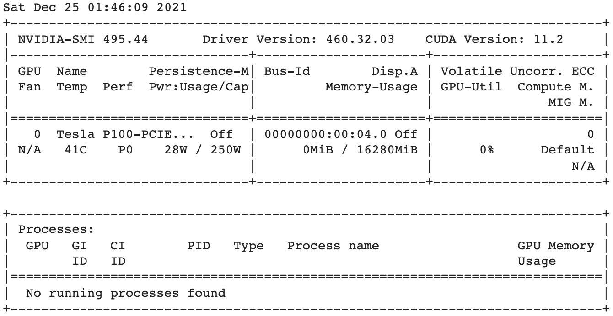
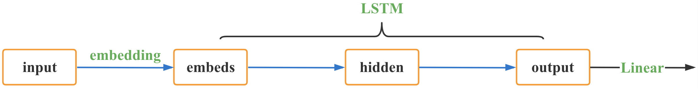
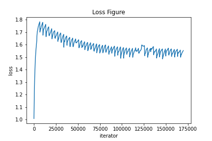
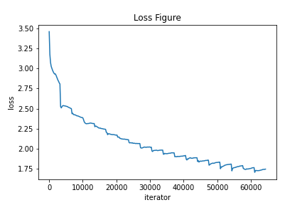
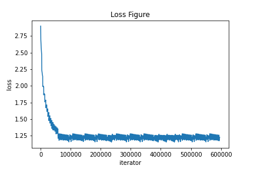

# AI-Poet
一款基于深度学习的 AI 作诗系统

## 目录

- [目录](#目录)
- [简介](#简介)
- [环境配置](#环境配置)
- [代码实现](#代码实现)
  - [模型接口](#模型接口)
  - [数据集](#数据集)
  - [LSTM 循环神经网络](#LSTM-循环神经网络)
  - [训练方法](#训练方法)
  - [诗句生成](#诗句生成)
- [结果分析](#结果分析)
- [运行展示](#运行展示)
  - [测试代码](#测试代码)
  - [成果展示](#成果展示)
- [项目总结](#项目总结)
  - [项目进展](#项目进展)
  - [创新点](#创新点)
  - [个人收获与致谢](#个人收获与致谢)

## 简介

近年来，人工智能渗透了我们生活的方方面面，给我们的衣食住行都带来了不少便利。纵观当今的人工智能在交通管理、环境治理、数字能源和社会治理的应用，无论是推荐系统还是异常检测，他们都在为人们的生存和生活添砖加瓦。

然而，“生活不止眼前的苟且，还有**诗**和远方”。我们有理由相信，当人们的基本生活需求已经满足后，**读诗写诗赏诗** 将会是人工智能的高层次应用。正如中国在盛唐时期古诗遍地开花，在不久的将来，人工智能写诗也必将掀起一波浪潮。

因此，AI-Poet 参考《Pytorch入门与实践》教程和 [GitLab 上开源代码框架](https://gitee.com/wannabe-9/LSTM_poem1)，采用 [**循环神经网络 (RNN)**](https://zh.wikipedia.org/wiki/%E5%BE%AA%E7%8E%AF%E7%A5%9E%E7%BB%8F%E7%BD%91%E7%BB%9C) 中的 [**长短期记忆 (LSTM)**](https://zh.wikipedia.org/wiki/%E9%95%B7%E7%9F%AD%E6%9C%9F%E8%A8%98%E6%86%B6) 模型进行训练，最终效果可以支持 **首句续写** 和 **藏头诗** 两种功能，并且实现了基本的音律和意境。

**关键词**
深度学习  循环神经网络  长短期记忆  预训练模型

## 环境配置

最初试图使用 _MacBook Pro 2017_ 进行训练，然而因为是 _Intel_ 显卡没办法直接使用 _cuda_，所以只能使用 cpu 导致训练速度极慢。经过粗略计算，跑完一遍模型需要约 15 天时间，因此不在本机跑模型。

之后尝试过阿里云租借服务器、百度飞桨平台等，但都觉得过于复杂。最终选用谷歌的 Colab 平台进行训练，所分配到的 GPU 为 _Tesla P100_，训练一次模型时间约为 3 小时。



## 代码实现
### 模型接口

主要关注 LSTM 层数，epoch 和 batch_size 参数。

**LSTM 层数**

在大规模翻译任务的经验中，简单的堆叠 LSTM 层最多可以工作 4 层，很少工作 6 层，超过8层就很差了。本模型选择使用 3 层。

**epoch**

向前和向后传播中所有批次的单次训练迭代，即训练过程中全部样本数据将被“轮”多少次。

**batch_size**

基本上现在的梯度下降都是基于 mini-batch 的，每次训练使用 batch_size 个数据进行参数寻优，一批中的数据共同决定了本次梯度的方向。


```python
class Config(object):
    num_layers = 3  # LSTM层数
		...
    lr = 1e-3
    weight_decay = 1e-4
    use_gpu = True
    epoch = 30
    batch_size = 25
    maxlen = 125  # 超过这个长度的之后字被丢弃，小于这个长度的在前面补空格
    plot_every = 200  # 每20个batch 可视化一次
    max_gen_len = 200  # 生成诗歌最长长度
    ...
    embedding_dim = 256
    hidden_dim = 512
    ...
```

### 数据集

使用整理好的 **numpy** 格式的[开源数据集](http://pytorch-1252820389.cosbj.myqcloud.com/tang_199.pth)，其中包含唐诗共 57580 首 * 125 字，不足和超出 125 字的都已经被补全或者截断。

```Python
# 处理数据
datas = np.load("/content/drive/MyDrive/AI-Poet/tang.npz", allow_pickle=True)
data = datas['data']
ix2word = datas['ix2word'].item()
word2ix = datas['word2ix'].item()
data = t.from_numpy(data)
dataloader = DataLoader(data,
                        batch_size=Config.batch_size,
                        shuffle=True,
                        num_workers=2)
```

**细节解释**

1. data 是 numpy 数组，共 57580 首 * 125 字。
2. word2ix 和 ix2word 都是字典类型，用于字符和序号的映射。

### LSTM 循环神经网络

LSTM 是一种特殊的 RNN，能够解决长序列训练过程中的梯度消失和梯度爆炸问题，相比于 RNN 只有一个传递状态 $h^t$，LSTM 有两个传输状态分别是 $c^t$ (cell state) 和 $h^t$ (hidden state)。

其中对于传递下去的 $c^t$ 改变得较慢，通常输出的 $c^t$ 是上一个状态传过来的 $c^{t - 1}$ 加上一些数值，而 $h^t$ 则在不同节点下有较大区别。本模型便采用了 LSTM 模型进行训练。

```Python
class PoetryModel(nn.Module):
    def __init__(self, vocab_size, embedding_dim, hidden_dim):
        super(PoetryModel, self).__init__()
        self.hidden_dim = hidden_dim
        # 词向量层，词表大小 * 向量维度
        self.embeddings = nn.Embedding(vocab_size, embedding_dim)
        # 网络主要结构
        self.lstm = nn.LSTM(embedding_dim, self.hidden_dim, num_layers=Config.num_layers)
        # 进行分类
        self.linear = nn.Linear(self.hidden_dim, vocab_size)

    def forward(self, input, hidden=None):
        seq_len, batch_size = input.size()
        # print(input.shape)
        if hidden is None:
            h_0 = input.data.new(Config.num_layers, batch_size, self.hidden_dim).fill_(0).float()
            c_0 = input.data.new(Config.num_layers, batch_size, self.hidden_dim).fill_(0).float()
        else:
            h_0, c_0 = hidden
        # 输入 序列长度 * batch(每个汉字是一个数字下标)，
        # 输出 序列长度 * batch * 向量维度
        embeds = self.embeddings(input)
        # 输出hidden的大小： 序列长度 * batch * hidden_dim
        output, hidden = self.lstm(embeds, (h_0, c_0))
        output = self.linear(output.view(seq_len * batch_size, -1))
        return output, hidden
```

**细节解释**



将数据集作为喂给模型的作为 _input_，先经过 _embedding_ 预处理得到 _embeds_ 层，然后经过 _LSTM_ 进行训练得到 _hidden_ 层和 _output_ 层，最后经过 _Linear_ 层判别，然后反向传播并循环训练即可。

### 训练方法

使用 GPU 进行训练，每次将数据输入进 LSTM 网络进行前向传播训练，然后使用误差反向传播进行修正，每隔一定数据量进行一次可视化，不断迭代更新。

```python
loss_data = []
# 进行训练并画图
def train():
  f = open(Config.result_path, 'w')
  for epoch in range(basic_start, Config.epoch):
      loss_meter.reset()
      for li, data_ in tqdm.tqdm(enumerate(dataloader)):
          # 将数据转置并复制一份
          data_ = data_.long().transpose(1, 0).contiguous()
          # 注意这里，也转移到了计算设备上
          data_ = data_.to(device)
          Configimizer.zero_grad()
          # n个句子，前n-1句作为inout，后n-1句作为label，二者一一对应
          # 经过 LSTM 网络进行前向传播
          input_, target = data_[:-1, :], data_[1:, :]
          output, _ = model(input_)
          # 误差反向传播
          loss = criterion(output, target.view(-1))
          loss.backward()
          Configimizer.step()
          loss_meter.add(loss.item())
          # 存储 loss 数据，方便之后画图
          loss_data.append(loss)
          # 进行可视化
          if (1 + li) % Config.plot_every == 0:
              print("训练损失为%s\n" % (str(loss_meter.mean)))
              ...
train()
```

### 诗句生成

#### 首句生成模式

优先使用风格前缀生成隐藏层，并结合用户输入的首句喂给预训练模型生成下一句，再使用生成的下一句作为下一次迭代的输入，不断迭代直至达到最大生成字数或遇到终止符 \<EOP\> 为止。

```python
# 给定首句生成诗歌
def generate(model, start_words, ix2word, word2ix, prefix_words=None):
		...   
    # 若有风格前缀，则先用风格前缀生成hidden
    if prefix_words:
        for word in prefix_words:
            output, hidden = model(input, hidden)
            input = input.data.new([word2ix[word]]).view(1, 1)

    # 开始真正生成诗句，如果没有使用风格前缀，则hidden = None，input = <START>
    # 否则，input就是风格前缀的最后一个词语，hidden也是生成出来的
    for i in range(Config.max_gen_len):
        output, hidden = model(input, hidden)
        if i < start_words_len:
            ...
            input = input.data.new([word2ix[w]]).view(1, 1)
        else:
            ...
            input = input.data.new([top_index]).view(1, 1)
        if w == '<EOP>':
            del results[-1]
            break
    return results
```

#### 藏头诗模式

优先使用风格前缀生成隐藏层，并结合用户输入每次喂给模型一个字作为开头并续写，迭代更新至用户输入用完为止。

```python
# 生成藏头诗
def gen_acrostic(model, start_words, ix2word, word2ix, prefix_words=None):
    input = (t.Tensor([word2ix['<START>']]).view(1, 1).long())
		...
    # 存在风格前缀，则生成hidden
    if prefix_words:
        for word in prefix_words:
            output, hidden = model(input, hidden)
            input = (input.data.new([word2ix[word]])).view(1, 1)

    # 开始生成诗句
    for i in range(Config.max_gen_len):
        output, hidden = model(input, hidden)
        top_index = output.data[0].topk(1)[1][0].item()
        w = ix2word[top_index]
        # 说明上个字是句末
        if pre_word in {'。', '，', '?', '！', '<START>'}:
            ...
        else:
            input = (input.data.new([top_index])).view(1, 1)
        result.append(w)
        pre_word = w
    return result
print("Define usage successfully\n")
```

## 结果分析

假如使用引用出处的预训练模型训练，由于其本身模型训练的太好，loss 值就很小，所以在我重新训练时 loss 值会先上升，而后 loss 值不断下降，在 1.5 左右达到收敛。



随后我没有使用其训练好的预训练模型进行训练，而是从头训练。在某次训练时，超参数 _epoch_ 较小，而 _batch_size_ 较大，造成了模型的欠拟合，从 loss-iteration 图可以看出，在模型后半阶段仍旧有下降空间，因此该训练模型欠拟合，诗歌效果不好。



不断调试超参数，直到各参数设置成[这样](./img/metedata.txt)，可以看出模型在大约 100000 次迭代后 loss 趋于稳定，有较小范围内波动属于正常现象，但基本稳定在 1.15 ~ 1.25 之间，可以认为模型训练已经收敛。经检验，该模型效果较好。



## 运行展示

### 测试代码

```python
...
def userTest():
    print("正在初始化......")
    datas = np.load('/'.join([Config.data_path, Config.pickle_path]), allow_pickle=True)
    data = datas['data']
    ix2word = datas['ix2word'].item()
    word2ix = datas['word2ix'].item()
    model = PoetryModel(len(ix2word), Config.embedding_dim, Config.hidden_dim)
    model.load_state_dict(t.load(Config.model_path, 'cpu'))
    if Config.use_gpu:
        model.to(t.device('cuda'))
    print("初始化完成！\n")
    while True:
        print("欢迎使用唐诗生成器，\n"
              "输入1 进入首句生成模式\n"
              "输入2 进入藏头诗生成模式\n")
        mode = int(input())
        if mode == 1:
            print("请输入您想要的诗歌首句，可以是五言或七言")
            start_words = str(input())
            gen_poetry = ''.join(generate(model, start_words, ix2word, word2ix))
            print("生成的诗句如下：%s\n" % (gen_poetry))
            f.write("首句生成模式: %s\n %s\n" % (start_words, gen_poetry))
        elif mode == 2:
            print("请输入您想要的诗歌藏头部分，不超过16个字，最好是偶数")
            start_words = str(input())
            gen_poetry = ''.join(gen_acrostic(model, start_words, ix2word, word2ix))
            print("生成的诗句如下：%s\n" % (gen_poetry))
            f.write("藏头诗模式: %s\n %s\n" % (start_words, gen_poetry))
userTest()
```

**使用方法**

使用 Colab 打开项目，在 _AI-Poet.ipynb_ 中 _User Test_ 部分点击运行，根据提示输入 **1（首句生成）**或者 **2（藏头诗）**来选择生成诗句模式。
若是**首句生成**模式，则需再输入诗歌首句。若是**藏头诗**模式，则需输入诗歌藏头部分。

### 成果展示

1. 首句生成

> 草色青青柳色黄，紫梨花谢春风开。
> 江水东流无社稷，君王朝日如冬霜。
> 白头老少今何幸，每见知君心不伤。

"草色青青柳色黄" 摘选自唐代诗人_贾至_的《春思》，原诗通过描写春草、柳树、桃花、李花等景色，借用东风、春日表达作者心中的愁绪和苦闷之情。

本模型则借助梨花、春风等景色，表达出古代君王一事无成悲叹万分的心境，最后一句更是感慨年华易逝，劝解年轻人珍惜青葱岁月。虽然与原诗不尽相同，但无论从意蕴、韵脚等方面都颇具形态。

------

> 寂寞梧桐深院锁清秋，灯火暗悠悠。
> 宛转芳兰满，芊绵坠露生。
> 露禽啼不寐，惊鸟不闻声。
> 悄悄星河晓，团团月殿横。

"寂寞梧桐深院锁清秋" 摘选自五代诗人_李煜_的《相见欢》，原诗站在一个孤独的人独自一人登上西楼，周围是一片清冷凄凉的秋色，烘托出诗人的离异思念爱国交织的情感。

本模型则渲染出昏暗的灯光下，有鸟禽深夜不眠啼叫，星河和月亮在惨淡的夜空上默默地交相浑映，营造出一种寂寥、清冷的孤寂氛围，也侧面体现出了作者思家思国思社稷的孤独心境。

------

> 明月几时有，秋风人未归。
> 青春来取道，春日向前飞。
> 洛阳桃李红，泪尽湘水流。
> 一杯须更醉，一日无所求。
> 朝朝海上起，细发斗中愁。
> 乡思日浩渺，妾思烟水流。
> 离怀一水色，何处不堪愁。
> 一醉不可识，日暮水东流。

"明月几时有" 摘选自宋代诗人_苏轼_脍炙人口的《水调歌头》，原诗勾勒出一种皓月当空、亲人千里、孤高旷远的境界氛围，反衬自己遗世独立的意绪和往昔的神话传说融合一处，表达了对胞弟苏澈的无限怀念。

本模型则在开头便点出"人未归"，营造出离别之痛，在整诗对于细节的描写更是令人称奇。例如"细发斗中愁" 将这份惆怅寄托在细发之上，愁之大与发之细形成鲜明反差，直击人心。而尾句更是写出了自己日日酒醉，消沉度日，将诗人无限的愁肠尽情释放出来。

------

2. 藏头诗模式

> 爱君古贤者，饮造古太平。
> 国有圣贤子，水有帝王城。
> 荣名贵相府，思国势不平。
> 校奉两仪血，源厉万姓名。

这首诗歌以交大校训 "饮水思源，爱国荣校" 为藏头部分，通过描写古代圣贤开明的君主治理社会井井有条，以及百姓思念这样贤明的君王，是对校训中 "感恩" 精神的完美诠释。

------

> 我有一人承晓镜，
> 喜君发我与君恩。
> 欢娱未得知君意，
> 你竟无言亦不还。

这首诗以 "我喜欢你" 藏头，适用于给单身青年表白专用，尤其适用于交大这般的工科院校。细细评味之后，发现描写的是破镜重圆，感激涕零的甜美爱情故事，可以用来给心爱的女孩子表白，也是本模型实用性强的一种体现。

------

3. 风格

**不使用风格**

> 红藕香残玉簟秋，鸳鸯一卷掩玲旌。
> 一声清晓起秋月，万籁千声惹九秋。

在给出首句且不使用风格的情况下，全诗通过描写鸳鸯、清晓秋月等景物，动静结合，渲染出一个完整的秋天模样。

------

**使用首句风格**

> 红藕香残玉簟秋，水精帘暖魂相续。
> 江南昔日不得游，落日孤舟漾楚波。

"红藕香残玉簟秋" 摘选自宋代女词人_李清照_的《一剪梅》，表达出词人与丈夫赵明诚离别后独上兰舟以排遣愁怀。

本模型则描绘出词人秋游江南不得，孤身在孤舟上赏着落日残辉，荡漾起楚楚波浪的孤寂情境。

------

**使用风格 "春风得意马蹄疾，一日看尽长安花"**

> 红藕香残玉簟秋，一旦春风携去来。
> 长歌宛转怨不见，一曲一曲歌声来。

风格语句摘选自唐代诗人_孟郊_的《登科后》，描绘了诗人金榜题名人生得意时的欢愉之情，是较为欢快明朗的风格。

本模型也同样以春风、长歌和歌声等物象，通过视听结合的手法，充分体现出诗歌第三句所言"怨不见"，从而烘托出与风格语句相类似的欢乐氛围。

------

**使用风格 "八百里分麾下炙，五十弦翻塞外声"**

> 红藕香残玉簟秋，风吹雨洒江楼席。
> 忆昔湖畔选旅人，今年战士归江上。

风格语句摘选自南宋词人_辛弃疾_的《破阵子·为陈同甫赋壮词以寄之》，通过创造雄奇的意境，生动地描绘出一位披肝沥胆、忠一不二、勇往直前的将军形象，同时也表达了杀敌报国、收复失地的理想。

本模型通过描写了在湖畔边追忆旅人，今年征战沙场的将士将从江上归来，抒发了雄心壮志的英雄气概，与原风格非常契合。

------

## 项目总结

### 项目进展

2021.11.25
正式开题，决定自己独立成队，这样可以大大拓宽我选题和做题的灵活性。 

2021.12.10
决定运用深度学习训练诗歌模型，开始搜索和整理网络资料，并配置模型训练环境。

2021.12.18
模型第一次训练成功，得到相应预训练模型，根据这次预训练模型进行人工测试并且调整超参数重新训练。

2021.12.26
完成模型训练和测试，完成所有报告材料，准备答辩。

### 创新点

1. **代码可拓展性高**，参数可调节并重新训练，生成方式也可再添加（例如藏尾诗等）。
2. **使用预训练模型**，将训练和生成分离，可以同时进行在线生成和离线训练，提高用户体验。
3. **LSTM 循环神经网络模型**，提高模型训练准确性，生成出的诗句优美自然。
4. **藏头诗模式**，将想说却又说不出口的话藏入诗中，实用性可见一斑。
5. **风格切换**，可以使用各种古诗作为风格，所生成的诗句则风格契合，大大提高模型实用性。

### 个人收获与致谢

在一个学期的《人工智能》选修课中，我学习到了诸如机器学习、深度学习、自然语言处理等多种人工智能相关技术，也逐步了解到自动驾驶、智能推荐等人工智能的广大应用前景，感触颇深。因为我自身是软件工程专业高年级学生（大三），且之前对机器学习和深度学习等技术略有接触，因此这次课程大作业选择了单人组队，这也大大增加了我许多选题和解题的灵活性。

在我看来，AI 的各种技术目前都还在起步阶段，相对成熟的推荐系统也仅仅是通过有限的用户浏览历史来进行简单的预测，而大数据时代的到来不仅意味着个人数据的广泛搜集和使用，更为计算机的算力提升和相应模型复杂度增加提供了契机。在未来，AI 必然会更进一步，做的更好，我也希望能够参与其中。

感谢《人工智能》课程 **孔令和老师**、**许岩岩老师**的精彩授课和悉心指导，**段勇帅助教**也为我提供了许多帮助。


